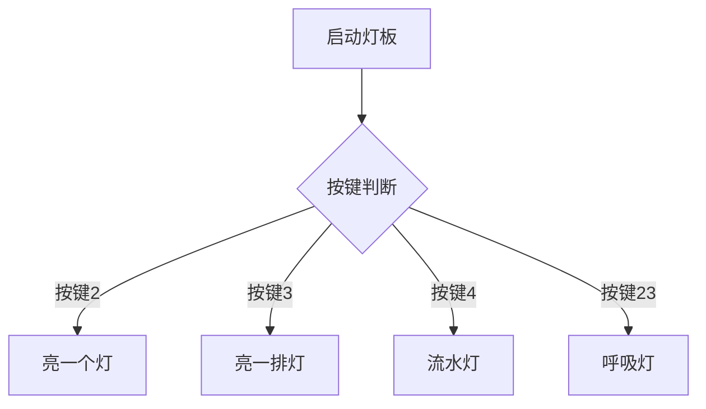

# 基于led8x8三色灯阵列的中期仿真报告
## 1. 材料准备
* ZYNQ-AX7020开发板
* 8x8三色矩阵Led灯板
* SPI接口设备
* 杜邦线若干
* Vivado 2017.4

## 2. 仿真思路

```mermaid
graph TD
    A[启动灯板] --> B{按键判断}
    B -->|按键2| C[亮一个灯]
    B -->|按键3| D[亮一排灯]
    B -->|按键4| E[流水灯]
    B -->|按键23| F[呼吸灯]
```

