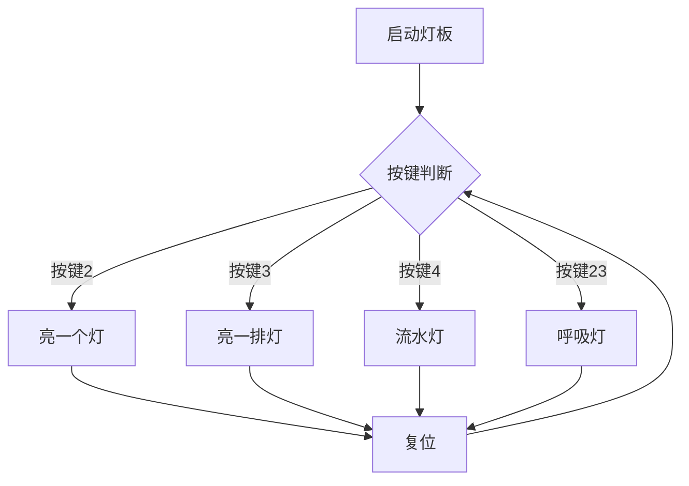

# 基于led8x8三色灯阵列的中期仿真报告
## 1. 材料准备
* ZYNQ-AX7020开发板
* 8x8三色矩阵Led灯板
* SPI接口设备
* 杜邦线若干
* Vivado 2017.4

## 2. 仿真思路



## 3. 仿真代码实例

* 8x8Led.v

```
`timescale 1ns / 1ps

module led_matrix_controller(
    input clk,          // 时钟信号 (50MHz)
    input rst,          // 复位信号
    input key2,         // 按键2：亮一个灯
    input key3,         // 按键3：亮一排灯
    input key4,         // 按键4：流水灯
    output reg [7:0] row,    // 行选择信号
    output reg [2:0] rgb [0:7] // 列RGB信号 (每列3位RGB)
);

// 状态定义
localparam IDLE     = 0;
localparam SINGLE   = 1;
localparam ROW      = 2;
localparam FLOW     = 3;
localparam BREATH   = 4;

reg [2:0] state = IDLE;
reg [2:0] next_state;

// 流水灯控制
reg [7:0] flow_pattern = 8'b0000_0001;
reg [23:0] flow_counter = 0;
localparam FLOW_DELAY = 24'd5_000_000; // 100ms延时 @50MHz

// 呼吸灯控制
reg [7:0] breath_intensity = 0;
reg breath_dir = 0; // 0=递增, 1=递减
reg [19:0] breath_counter = 0;
localparam BREATH_STEP = 20'd50_000; // 1ms步进 @50MHz

// 按键同步与消抖
reg [1:0] key2_sync, key3_sync, key4_sync;
reg [15:0] debounce_counter;

always @(posedge clk) begin
    key2_sync <= {key2_sync[0], key2};
    key3_sync <= {key3_sync[0], key3};
    key4_sync <= {key4_sync[0], key4};
end

// 状态机更新
always @(posedge clk or posedge rst) begin
    if (rst) state <= IDLE;
    else state <= next_state;
end

// 状态转移逻辑
always @(*) begin
    next_state = state;
    case (state)
        IDLE: begin
            if (~key2_sync[1] & key3_sync[1] & key4_sync[1]) 
                next_state = SINGLE;
            else if (key2_sync[1] & ~key3_sync[1] & key4_sync[1]) 
                next_state = ROW;
            else if (key2_sync[1] & key3_sync[1] & ~key4_sync[1]) 
                next_state = FLOW;
            else if (~key2_sync[1] & ~key3_sync[1] & key4_sync[1]) 
                next_state = BREATH;
        end
        default: begin
            if (~key2_sync[1] & ~key3_sync[1] & key4_sync[1]) 
                next_state = BREATH;
            else if (key2_sync[1] & key3_sync[1] & key4_sync[1]) 
                next_state = IDLE;
        end
    endcase
end

// 流水灯控制
always @(posedge clk) begin
    if (state == FLOW) begin
        flow_counter <= flow_counter + 1;
        if (flow_counter >= FLOW_DELAY) begin
            flow_counter <= 0;
            flow_pattern <= {flow_pattern[6:0], flow_pattern[7]};
        end
    end else begin
        flow_pattern <= 8'b0000_0001;
    end
end

// 呼吸灯控制
always @(posedge clk) begin
    if (state == BREATH) begin
        breath_counter <= breath_counter + 1;
        if (breath_counter >= BREATH_STEP) begin
            breath_counter <= 0;
            breath_intensity <= breath_dir ? (breath_intensity - 1) : (breath_intensity + 1);
            if (breath_intensity == 8'hFF) breath_dir <= 1;
            else if (breath_intensity == 0) breath_dir <= 0;
        end
    end else begin
        breath_intensity <= 0;
        breath_dir <= 0;
    end
end

// LED输出逻辑
integer i;
always @(posedge clk) begin
    row <= 8'b0000_0000;  // 默认所有行关闭
    for (i = 0; i < 8; i = i + 1)
        rgb[i] <= 3'b000; // 默认RGB关闭

    case (state)
        SINGLE: begin
            row[0] <= 1'b1;      // 第一行
            rgb[0] <= 3'b111;    // 第一列亮白色
        end
        
        ROW: begin
            row <= 8'b1111_1111; // 所有行
            rgb[0] <= 3'b111;    // 第一列亮白色
        end
        
        FLOW: begin
            row <= flow_pattern;  // 当前点亮行
            for (i = 0; i < 8; i = i + 1)
                rgb[i] <= 3'b111; // 整列亮白色
        end
        
        BREATH: begin
            row <= 8'b1111_1111; // 所有行
            for (i = 0; i < 8; i = i + 1)
                rgb[i] <= (breath_intensity > 8'h80) ? 3'b111 : 3'b000; // PWM效果
        end
    endcase
end

endmodule
```

功能说明：

* __按键2 (亮一个灯)__：点亮左上角第一个LED（行0列0），白色。
* __按键3 (亮一排灯)__：点亮第一列所有LED，形成垂直亮线。
* __按键4 (流水灯)__：LED从第一行开始逐行点亮，形成流水效果（周期约100ms）。
* __按键2+3 (呼吸灯)__：所有LED同步进行亮度渐变（通过PWM模拟呼吸效果）。

## 4. Testbench实例

```
module tb_led_matrix();

reg clk;
reg rst_n;  // 低电平有效的复位
reg key2, key3, key4;
wire [7:0] row;
wire [2:0] rgb [0:7];

// 实例化控制器
led_matrix_controller uut (
    .clk(clk),
    .rst_n(rst_n),
    .key2(key2),
    .key3(key3),
    .key4(key4),
    .row(row),
    .rgb(rgb)
);

// 时钟生成 (50MHz)
initial begin
    clk = 0;
    forever #10 clk = ~clk; // 20ns周期
end

// 测试序列
initial begin
    // 初始化
    rst_n = 0; // 复位有效（低电平）
    key2 = 1; key3 = 1; key4 = 1;
    #100;
    rst_n = 1; // 释放复位
    #100;
    
    // 测试1: 按键2 (亮一个灯)
    $display("测试1: 按键2 - 亮一个灯");
    key2 = 0;
    #100;
    key2 = 1;
    #200;
    
    // 测试2: 按键3 (亮一排灯)
    $display("测试2: 按键3 - 亮一排灯");
    key3 = 0;
    #100;
    key3 = 1;
    #200;
    
    // 测试3: 按键4 (流水灯)
    $display("测试3: 按键4 - 流水灯");
    key4 = 0;
    #100;
    key4 = 1;
    #1000; // 观察流水效果
    
    // 测试4: 按键2+3 (呼吸灯)
    $display("测试4: 按键2+3 - 呼吸灯");
    key2 = 0; key3 = 0;
    #100;
    key2 = 1; key3 = 1;
    #2000; // 观察呼吸效果
    
    $display("仿真结束");
    $finish;
end

// 监控输出
always @(posedge clk) begin
    $display("Time=%t | State=%d | Row=%b | RGB0=%b", 
             $time, uut.state, row, rgb[0]);
end

endmodule
```

## 4. 仿真波形结果
波形如下图所示：

"波形图")
